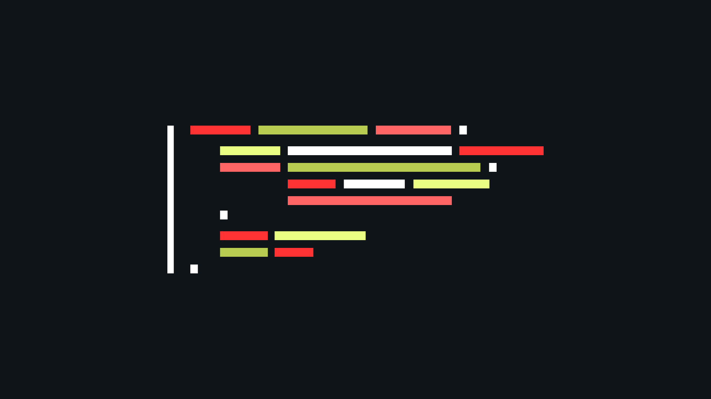

<h1>Wallpaper Fake Code</h1>

Download this free wallpaper fake code and custom it with your vscode theme

 

## Inspiration

https://www.instagram.com/morgan.codes/

## Todo

-   [ ] custom color
-   [ ] upload code

## Contribution

### Prerequisite

[Node.js](https://nodejs.org/en/) are installed on your machine.

### Installation

-   Clone this repo
-   Run `make install` to install dependencies
-   Run `make dev` to start the project
-   Play on [http://localhost:3000/](http://localhost:3000/)

> Type make help to list all commands available

### Add a new theme

You can add your theme in [themes.json](./src/themes.json) file, please keep the alphabetical order.
